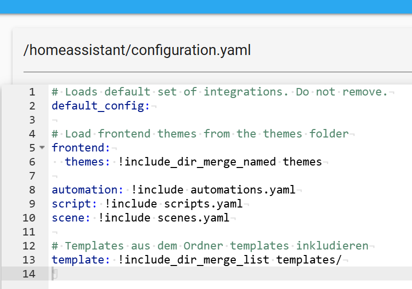

Um gewisse Funktionen in Home Assistant realisieren zu können,
benötigt man Templates.

Dies kann man bspw. mit dem FiledeFile editor in der configuration.yaml einbinden.
Ich habe mich dazu entschieden einen Ordner "templates" anzulegen und direkt den gesamten Inhalt dieses Ordners in die configuration.yaml zu laden.

Das Einbindung erfolgt durch:

``
# Templates aus dem Ordner templates inkludieren
template: !include_dir_merge_list templates/
``